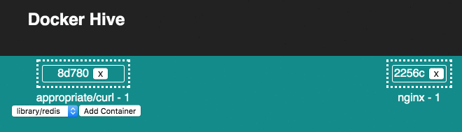
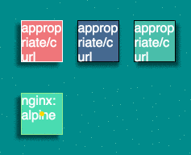

# Container Hive


## Why

Visualization helps provides intuition and understanding. This project tries to answer the question

    What am I running on my environment?

## What

Container Hive's main goal is to give a user friendly display of everything that is running in your Docker daemon and, in the future, provide powerful CRUD capabilities. 

## How

Container Hive is a Node app built with React, µWS, execa, Dockerode, and Express.

## Try it out

### Setup Sysdig on your platform

#### Ubuntu/Debian

```bash
apt-get -y install linux-headers-$(uname -r)
docker pull sysdig/sysdig
```

#### Centos/RHEL

```bash
yum -y install kernel-devel-$(uname -r)
docker pull sysdig/sysdig
```

#### CoreOS

```bash
docker pull sysdig/sysdig
```

#### Docker-Machine on Mac

Setup the VM first

```bash
docker-machine create --driver=virtualbox default
eval $(docker-machine env)
```

#### Docker for Mac (currently buggy and unreliable)

Follow the [latest mobydig guide](https://github.com/fdebonneval/mobydig) to compile sysdig for Docker for Mac. You can follow the official sysdig issue [here](https://github.com/draios/sysdig/issues/637)

```bash
git clone https://github.com/fdebonneval/mobydig
cd mobydig
make build
# you'll need to make sure to run this container before running `npm run start-server` which will match the container name and listen to its logs
docker run -t --name sysdig_container_hive -d --rm --privileged -v /var/run/docker.sock:/host/var/run/docker.sock -v /dev:/host/dev -v /proc:/host/proc:ro -v /lib/modules:/host/lib/modules:ro -v /usr:/host/usr:ro -v /usr/bin/docker:/usr/bin/docker:ro mobydig:dev sysdig -pc evt.type=accept
```

#### Other platforms

Submit issues and PRs please

### Setup backend and frontend

```bash
npm install
npm run start-server
npm run start
```

Your browser should open a new tab with the app loaded on http://localhost:8000

## UI Concept


## Screenshots (WIP)






## Contibuting

```bash
# Start React App with Hot Reloading
npm run start

# Start Backend App
npm run start-server
```

Pull Requests are welcomed and encouraged!
