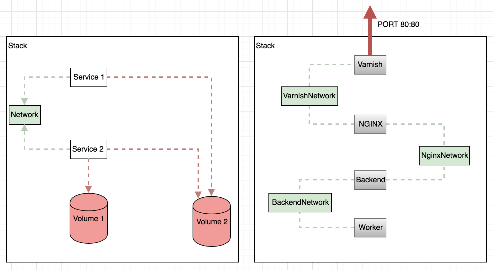
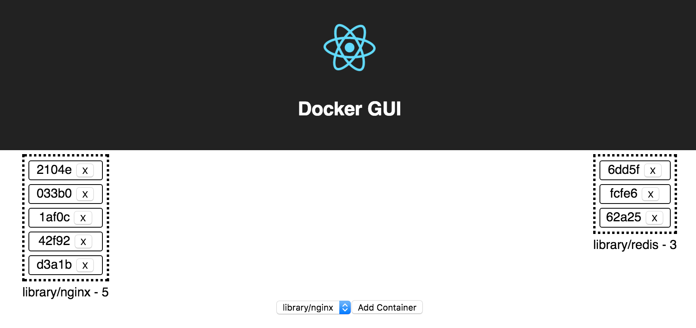

# Docker Hive


## Try it out on Mac
```bash
# https://github.com/fdebonneval/mobydig
npm run start-server
npm run start
# should open a browser with the UI loaded
```

## Why? 
Visualization helps provides intuition and understanding. This project tries to answer the question

    What am I running on my environment?

## What? 
Docker GUI's main goal is to give a user friendly display of everything that is running in your Docker daemon and, in the future, provide powerful CRUD capabilities. 

## How?
Docker GUI is a Node app built with React, Refetch, Dockerode, and a basic Express server.

## UI Concept



## Screenshots (WIP)




## Known Issues

* Running containers in detached mode is not possible unless the container has an entrypoint

## Contibuting

```bash
# Start React App with Hot Reloading
npm run start

# Start Backend App
npm run start-server
```

Pull Requests are welcomed and encouraged!